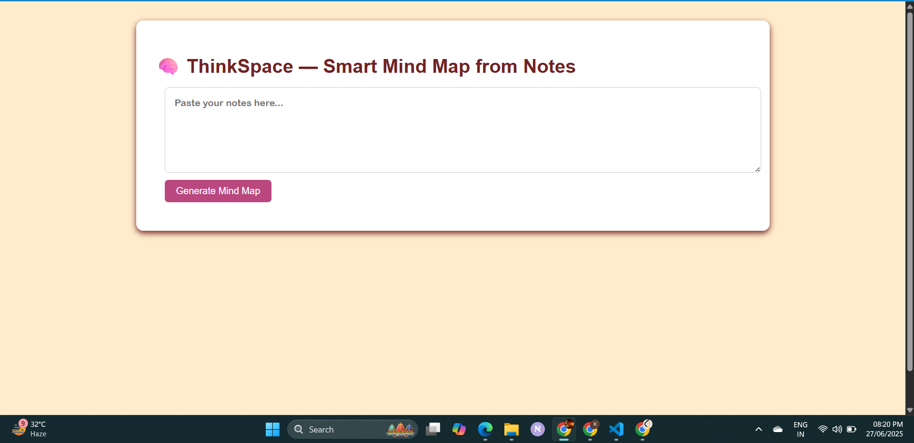
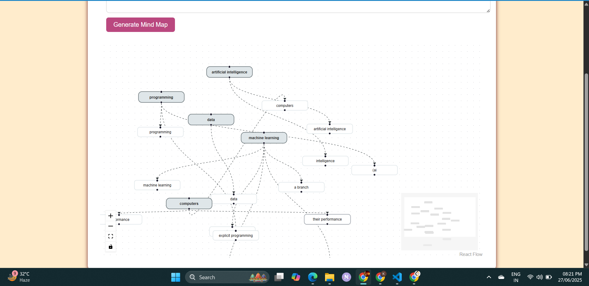

# 🧠 ThinkSpace — Smart Mind Map from Notes

ThinkSpace is an intelligent mind map generator that transforms plain text notes into visually structured mind maps using Natural Language Processing (NLP) and React Flow. It extracts keywords, identifies semantic clusters like definitions, applications, and techniques, and visualizes the relationships between them.

---

## 🚀 Features

- ✨ Extracts keywords and concepts from raw notes
- 🧠 Clusters related ideas under semantic categories (e.g., Definition, Application)
- 🔗 Detects logical relationships (e.g., subject-verb-object)
- 🖼️ Generates interactive and visually styled mind maps using **React Flow**
- ⚡ Backend powered by **spaCy** and **KMeans Clustering**
- 🔒 Clean, responsive UI with live updates

---
## 🖼️ Screenshots
| Input Interface | Generated Mind Map |
|-----------------|--------------------|
|  |  |

---

## 🛠️ Tech Stack

| Frontend      | Backend        | NLP & ML           |
|---------------|----------------|---------------------|
| React + React Flow | Flask + REST API | spaCy, scikit-learn (KMeans) |

---
